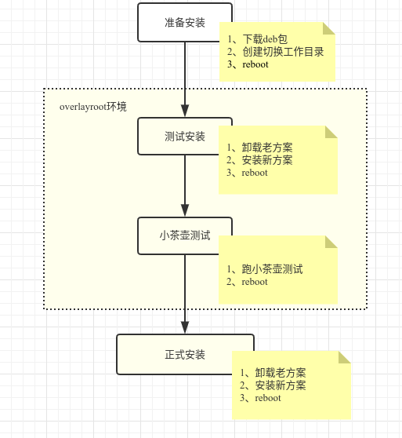

## 1、问题介绍
### 1.1、显卡驱动管理介绍
&ensp; 显卡驱动管理器切换驱动大致流程如下图所示：




&ensp; 显卡驱动工具中使用到了一个很关键的技术，用来保证当显卡驱动切换失败时，系统还能完好无损的回退到切换前的状态，这个关键技术就是```overlayroot```。

&ensp; 按照我最初对```overlayroot```的理解，它应该是在整个系统上覆盖了一层(可以抽象理解为PS的图层),然后在系统上做的任何修改，最后都可以撤销，不留下任何痕迹。但是其实不然，在遇到下面问题之后才发现```overlayroot```并非能够对整个系统起到"保护"作用，具体情况请看后面讲解。

&ensp;

### 1.2、问题现象
&ensp; 该问题是由测试那边发现的，他们在测试```nvidia```闭源驱动向开源驱动切换时，测试安装完毕，同时小茶壶测试也跑成功，在最后需要点确认键时没有点确认，而是点取消，然后重启系统，系统起来后，已经退出了```overlayroot```环境，这时应该回退到闭源驱动才对，但是此时问题出现了，和期望的情况不一样，系统使用的却是开源驱动。

&ensp;

## 2、问题分析

### 2.1、overlayroot背景知识介绍
&ensp; ```overayroot```其实是```overlayfs```的一种特殊应用，所以要弄懂```overlayroot```就必须先了解```overlayfs```，由于篇幅限制，这里都只做简单介绍。

#### 2.1.1、overlayfs

&ensp; overlafs挂载：

&ensp; ```mount -t overlay overlay -o lowerdir=lower,upperdir=upper,workdir=work merged```
* ```lowerdir:```是只读层，对用户不可见；
* ```upperdir:```是可读写层，对用户不可见；
* ```merged:```是合并层，对用户可见。

&ensp; **overlayfs**是一种堆叠文件系统，它的作用是把底层目录（包括```lower```和```upper```目录）“合并”到一起，它具有如下特性：
* 如果用户修改某个文件，并且这个文件来自于```lower```层，那么系统就会自动把该文件拷贝一份到```upper```层再做修改；
* 如果用户删除某个文件，并且这个文件来自于```lower```层，系统会自动在```upper```层创建一个同名的字符设备文件，overlay文件系统通过这个字符设备文件把```lower```层的同名文件覆盖，此时用户就看不到这个文件；
* 如果用户修改或删除的文件来自```upper```目录，那么系统就会和直接修改或删除这个文件。

&ensp; 从这些特性可以看出，实际上真正被overlay保护的就是```lower```层，```upper```层保存的是修改差异。


#### 2.1.2、overlayroot
&ensp; overlayroot挂载：

&ensp; ```mount -t  overlay /dev/nvme0n1p3 -o lowerdir=/media/root-ro,upperdir=/media/root-rw/overlay,workdir=/media/root-rw/overlay-workdir overlayroot```

&ensp; 其中```/dev/nvme0n1p3```是我的测机器上的根分区，系统启动之初（init-bottom阶段），系统会把根分区挂载到```/media/root-ro```目录，然后再把这个目录作为```lowerdir```层进行overlay文件系统挂载，所从这条挂载语句可以看出，overlayroot其实就是把系统的根分区作为```lowerdir``层进行挂载。

&ensp; 所以就不难理解，```overlayroot```其实保护的是根分区。

&ensp;

### 2.2、问题分析步骤

&ensp; 开始看到上述问题现象时感觉很懵，整个切换都在overlay文件系统下进行，overlay退出时所有的修改应该才对，结果没有回退，问题出在那儿呢？整个分析步骤如下：

* **第一步：** 没有回退回去，说明切换过程中的修改还有“残留”没被撤销，系统不可能和切换前完全一样，这一点是绝对肯定的，否则就不会出现回退不到之前的的状态。

* **第二步：** 既然有“残留”修改没有清理干净，那就从修改入手进行分析，切换方案首先要不旧方案卸载，然后在装上新方案，现在的现象是没有回退成功，还是老方案，那会不会就旧方案已经卸载了呢？这里的旧方案是nvidia闭源方案（见前面现象描述），那就看这个方案的安装包是否还在：```dpkg -l  |grep nvidia-driver```

* **第三步：** 结果发现nvidia-driver没有卸载。闭源驱动的安装包处于安装状态，但是系统显示却使用的不是闭源驱动方案，而是开源方案，难道是驱动模块加载出了问题？那就查看一下内核模块加载情况：查看闭源驱动：```lsmod  |grep nvidia```；查看开源驱动：```lsmod  |grep nouveau```。

* **第四步：** 查看后发现果然加载的是nouveau（开源驱动），开源驱动模块是内核自带的，无需安装其他deb包，闭源驱动也安装在系统上，为什么加载的不是闭源驱动，而是开源驱动？难道同时安装开源驱动和闭源驱动后系统优先采用开源驱动，如果是这样，切换前开源驱动和闭源驱动也同时安装在系统上啊，为什么加载的是闭源驱动而不是开源驱动呢？这说明肯定还有“残留”修改没有被发现，如果是完全一样，就不会出现这种差异。

* **第五步：** 然后我又想到，系统内核模块加载有一个黑名单机制，可以通过配置黑名单去阻止特定的内核模块加载，是不是因为有和黑名单阻止nvidia模块加载呢？于是就在系统上看了一下，果然有一个```/etc/modprobe.d/nvidia-blacklists-nouveau.conf```黑名单文件，但是里面内容为:```blacklist  nouveau```,这表示是阻止```nouveau```模块加载啊，怎么结果却正好相反呢？

* **第六步：** 之前我验证过，只要在```/etc/modprobe.d/```目录下添加某个内核模块的黑名单，然后再执行```update-initramfs  -u```，命令把黑名单内容同步到```initrd```文件中去，重启后一定会生效，现在```/etc/modprobe.d/nvidia-blacklists-nouveau.conf```这个黑名单没有起作用，难倒是因为没有同步到```initrd```？如果是这样，现在执行一下```update-initramfs  -u```,重启后```nouveau```肯定不会被加载。


* **第七步：**  按照上面的猜测进行了测试，结果和预测完全一致，```update-initramfs  -u```，重启后发现加载模块不再是```nouveu```,而是```nvidia```。通过这个测试结果，可以肯定，安装过程中肯定对```initrd```进行了修改，而且最后overlayroot退出时，这个修改没有撤销。对```initrd```进行了修改很好理解，安装或卸载闭源和开源驱动deb是都会执行```update-initramfs  -u```，对```initrd```进行更新，但是最后这个修改为什么没有撤销呢？


* **第八步：** 到这前面的猜测已基本证实，在退出```overlayroot```时，有些“遗留”的修改没有被撤销，比如对```initrd```的修改。为了找出这个原因，只好再硬着头皮研究一下```overlayroot```，具体情况见前面背景知识介绍。

* **第九步：** 捋清楚```overlayroot```工作原理后，这个问题就显而易见了，```overlayroot```保护的是根分区，而```initrd```存放在```boot```分区，所以很有可能是这个原因导致了对```initrd```的修改没有撤销。为了证明这个猜想，我就做了个测试，测试步骤：第一步：执行```sudo overlayroot-enable```,然后重启系统； 第二步：系统起来后，分别在```/ 目录```和```/boot 目录```各创建一个文件；第三步：执行```sudo overlayroot-disable```，然后再重启系统；第四步：系统起来后，分别去```/ 目录```和```/boot 目录```下查看创建的文件是否存在，结果发现```/boot 目录```下的文件还存在，而```/ 目录```下的文件不见了。

&ensp;

### 2.3、问题结论
&ensp; 根据以上分析，可以得出的结论是：闭源切驱动向开源驱动切换，在小茶壶界面点取消，重启后驱动方案没有退回到闭源切驱动，该问题的根因是overlayroot只对根分区起保护作用，对根分区之外的分区（比如boot分区）不起作用，切换过程中会删除```/etc/modprobe.d/nvidia-blacklists-nouveau.conf```这个文件，同时又会执行```update-initramfs  -u```让这个修改同步到```initrd```文件，```initrd```文件存放在boot分区，所以这个修改在```overlayroot```退出后没有没撤销。系统重启加载模块时就会加载```nouveau```，所以最后系统起来后看到的方案就是开源驱动。

&ensp;

## 3、解决办法
&ensp; 问题根因找出来之后，我第一个想到的解决办法就是，仿照根分区，把boot分区也挂载成overlayfs，但是这个设想很快就被放弃了，原因是前面已经讲过overlayroot是在系统启动之初（init-bottom阶段）进行挂载的，所以boot分区也必须在这个阶段挂载，但是系统一开始启动都需要存放在boot分区的内核镜像文件和和initrd文件，而挂载文件系统最早也只能在内核启动后并且initrd解压挂载完成后进行的，这就出现鸡生蛋还是蛋生鸡的难题里面去了，所以这个方法肯定不行。

&ensp; 既然boot分区不能挂载成overlayfs，那么可否针对initrd修改差异入手，也就是说修改了什么内容，在最后退出overlayroot时在给它还原回去不就可以了吗？导致现在这个问题的根因是修改了```/etc/modprobe.d/nvidia-blacklists-nouveau.conf```，然后最后有把这个修改同步到了initrd文件，那么能否在最后退出overlayroot时判断一下```/etc/modprobe.d/nvidia-blacklists-nouveau.conf```是否被修改过，如果被修改，那就给还原回去，然后再执行一次```update-initramfs  -u```同步一下不就好了吗？

&ensp; 根据上述分析貌似只有第二个方案可行，既然可行，那就想怎么实现吧。

&ensp; 前面已经介绍overlayfs特性的时候已经讲过，对于```lower```层的修改，都会反映到```upper```层（具体怎么反映的请参考前面的overlafs介绍），换句话说```/etc/modprobe.d/nvidia-blacklists-nouveau.conf```这个文件有没有被修改，只要```upper```层有没有这个同名文件就可以确定，却被修改过后，还要确定是如何被修改的，这里只有删除和创建两种情况，里面的内容永远不会被修改，那就好办了，只需要当前系统（```merge层```）是否有这个文件就可以确认是修改是删除还是创建。具体实现流程图如下：

```
 nvidia_blacklist_recovery(){
     nvidia_blacklist_file="/etc/modprobe.d/nvidia-blacklists-nouveau.conf"
     upperdir="/media/root-rw/overlay/"
     if [ -e "${upperdir}/${nvidia_blacklist_file}" ]; then
        if [ -e "${nvidia_blacklist_file}" ]; then
            rm -f ${nvidia_blacklist_file}
        else
            echo "blacklist  nouveau" > ${nvidia_blacklist_file}
        fi
        update-initramfs -u
     fi
 }

```

&ensp;

## 4、小结
* 上述解决办法中，我们只针对```/etc/modprobe.d/nvidia-blacklists-nouveau.conf```这一处修改进行了修改，那么会不会还有其他没有发现的修改会影响到```boot分```区呢？这个不排除有这个可能。那有什么办法可以一次性把这些修改都找回来，都进行还原呢？答案是貌似没有什么好办法，因为可能修改的地方太多，没办法全部找出来，另一方面也没有这个必要，对```boot```分区的修改只可能是```initrd```，不太会有可能去改```grub```和内核镜像，对```initrd```修改无非是增加或删除与新旧方案相关内核模块，或者是一些和相关内核模块的加载配置文件，如果这些内容对切换方案有影响，就肯定会暴露出来（检验的标准就是内核模块加载有没有出错），没暴露出来就可能没有什么问题。后面再增加其他显卡驱动切换方案，如果发现类似的问题，也参考上述方法进行排查和解决就可以了。

* 根据前面分析，```overlayroot```用在版本回退这个地方有个致命的短板就是只能对根分区进行保护，无法对其他分区保护，对其他分区的修改就无法撤销，这个可能也是无法解决的死节，所以在使用的```overlayroot```时候一定要留意这个问题，如果发现对除根分区外的其它分区有修改，同时这个修改又必须撤销回去，就要针对这个修改单独做回退措施了。

* 有句话叫塞翁失马焉知非福，前面一直在讨论```overlayroot```覆盖不到跟分区之外的其他分区这个缺陷，但另外一个场景这却是一个优点，比如log保存，就拿显卡驱动管理器为例吧，前端日志保存在``` ~/.cache/deepin/deepin-graphics-driver-manager/deepin-graphics-driver-manager.log```，和```/var/log/deepin/deepin-graphics-driver-manager-server.log```, 按照我们系统常规的安装方法，这两个文件那都存放在```data 分区```，这样以来，在```overlayroot```开启阶段保存的日志在```overlayroot```退出后也可以正常保存，如果不是因为overlayroot只保护根分区，日志保存这个问题可能又是一个大难题。


