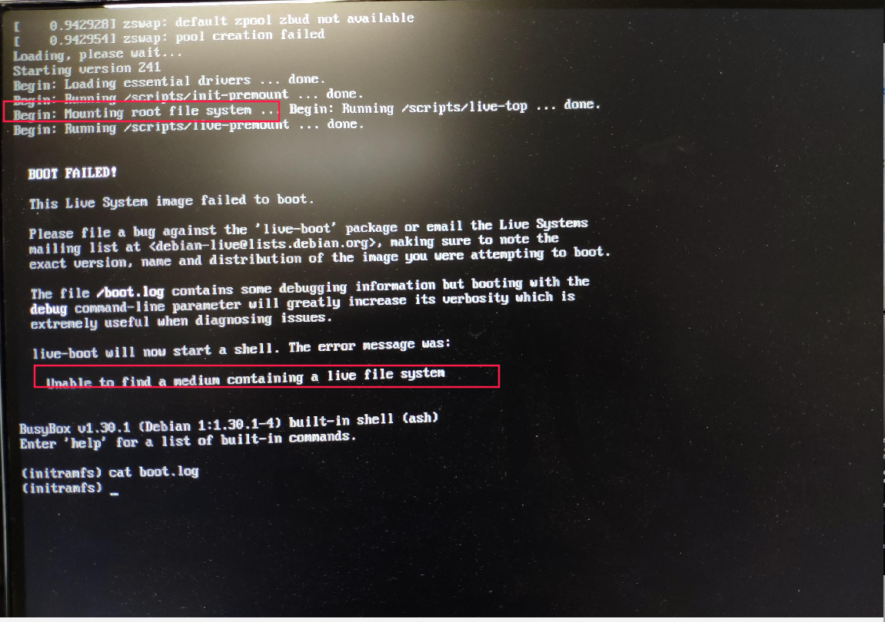
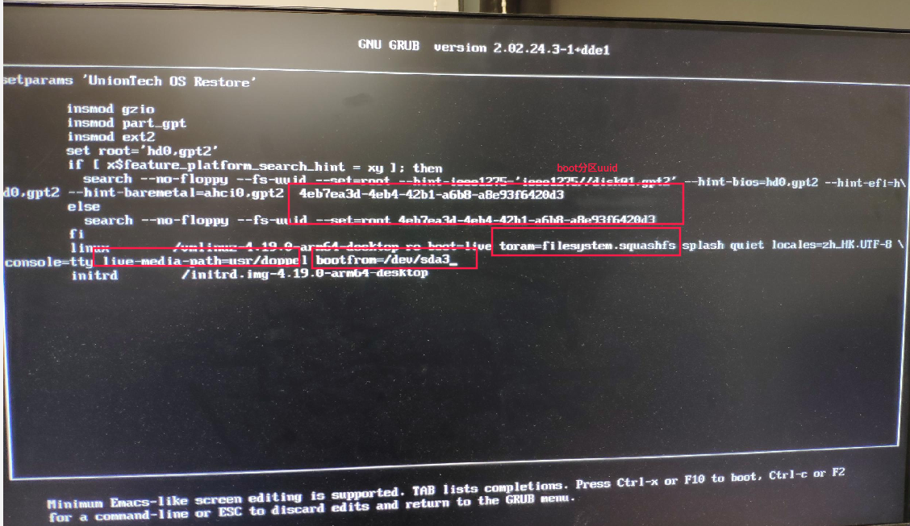
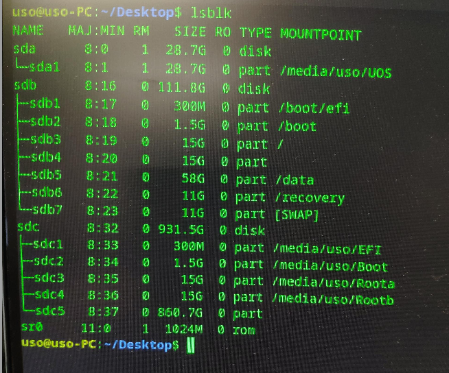

## １、背景介绍
> 之前为了解决机器上存在双live系统时live文件系统挂载出错的问题，就在live系统的cmdline中增加了一个参数：bootfrom=/dev/xxx。

> bootfrom是live-boot代码对外提供的一个参数，该参数可以有以下几种取值：
* removable-usb: 可移动usb类型磁盘设备。
* removable:　可以移动类型磁盘设备。
* /dev/xxx:　特定磁盘分区，可以是上述两种类型磁盘分区。

> 如果没有bootfrom这个参数，live系统启动时会遍历机器上所有的磁盘分区，去寻找live根文件系统，一旦找到就退出遍历，然后就挂载该文件系统。如果加了bootfrom这个参数，就会限制遍历搜索范围，当这个参数值是/dev/xxx时，就只在/dev/xxx这个磁盘分区查找live根文件系统，如果能找到就挂载查找到的这个根文件系统，否则系统就会启动失败。

## ２、问题描述
> 一次偶然测试，发现机器插上U盘后live系统启动到initrd阶段出现异常，提示找不到根文
件系统，截取打印信息如下：

&ensp;

## ３、问题分析

> 根据前面观察到的打印信息，提示找不到根文件系统，而且可以看出问题的地方在scripts/live 脚本中，看到这些现象后，头脑中对这个问题的根因有了一个大致的猜想。这些猜想是基于前面背景介绍一节中对live根文件系统挂载过程理解。

> 接下来看一下当前live系统grub内容：

> 这上面的内容包含如下的信息：
* boot分区uuid(...-aBe93f6420d3):通过这uuid可以找到内核镜像和initrd.image存放位置（boot分区）。
* toram: 指定live根文件系统镜像文件名称，同时toram也表示把文件系统加载到内存的意思。
* live-media-path:指定live根文件系统镜像在某挂载点下面的存放的目录。
* bootfrom：表示在那个磁盘分区或者那种类型的设备下面查找存放根文件系统镜像文件的目录，这个参数取值可以是removable-usb、removeable和磁盘盘符名。前两个表示在移动存储设备里面查找，第三个表示在特定磁盘分区里面查找。

> 根据以toram、live-media-path、bootfrom三个参数，就可以确定live根文件系统的路径，以现在这台测试机器为例，/dev/sda3表示第一个系统的根分区，其挂载点是 /，所以很显然live根文件系统镜像文件存放路径就是/use/doppel/filesystem.squashfs。

> 如果live-boot在/dev/sda3上找不到/use/doppel/filesystem.squashfs这个文件，就会挂载失败。而当前问题现就是因为找不到根文件系统所致。

> gruｂ配置成这样，是前面几个版本的修改，是为了解决双live文件系统挂载出错的问题，之前测试都通过了，为什么现在在这台机器上出问题了呢？

> 经过反复测试后发现，只要拔掉U盘，重启后再进live系统，一切正常；一旦插上U盘就会出现异常。而且还发现当插上U盘重启后，机器上其他磁盘的盘符会发生变化。

> 比如我现在这台机器，总共有两块硬盘，没插u盘之前这个两块硬盘盘符为sda和sdb，插上u盘重启之后，u盘盘符变为sda，原来的sda变为sdb，原来的sdb变为sdc，如下图：

&ensp;

> 注：根据目前测试的几台机器，所有接sata硬盘的arm机器都有这个现象。

> 分析到这里基本上可以确定，该问题根因是**插上u盘后，磁盘盘符变化，按照原来指定的分区查找不到live根文件系统了**。

> 为了进一步证明这个猜想，我又做了如下测试：
> 因为插上u盘后，第一块硬盘的盘符变成sdb，相应的根分区也跟着变为了/dev/sdb3,如果问题根因真如上所述，那么把bootfrom这个参数值改为/dev/sdb3, live系统就应该可以正常启动，测试之后发现确实是这样。

> 现在已可以完全肯定，问题根因就是如此。

&ensp;

## ４、解决方案
> 根据前面分析，为了解决双live系统挂载出错的问题，在grub上添加了bootfrom这个参数,而增加的这个参数又引入了现在这个新问题。接下来该怎么解决这个新问题呢？把bootfrom参数去掉？显然不行，那有没有一个两全其美的办法呢？办法肯定是有的。

> 既然这个问题是因磁盘盘符名称变化引起的，那可不可以不用盘符名指定磁盘分区，而用uuid指定呢？理论上讲是可以的，因为盘符名和分区uuid都可以代表一个特定的磁盘分区。但这里有个问题，那就是bootfrom不能解析uuid这种参数(问题背景一节有有介绍)。如果还要继续使用这种办法解决问题，那剩下的工作就是要让bootfrom能够接受uuid这种参数。解决这个问题有两个可选办法：
* 方法一：修改live-boot代码，让bootfrom解析的参数类型增加一种，然后根据uuid找到对应的磁盘分区；
* 方法二：修改initramfs-tools/init代码，让它在调用live-boot之前的把uuid的磁盘分区转换成对应的盘符名，然后再传给live-boot。

> 这两个办法都可以解决这个问题，但是它实现起来的难度和风险差异很大：
* 从难度方面考虑，通过uuid解析磁盘设备，在initramfs-tools/init代码有相应的接口，但是在lvie-boot代码中没有这样接口，需要自实现。系统运行起来后，通过uuid解析出对应的分区设备比较容易，比如使用lsblk命令在加上sed 、cut之类等shell语句就可以实现，但是在initrd环境完成实现这个功能就非常有难度了，而且需要考虑的场景也很多，具体情况大家去阅读一下initramfs-tools/scrpit/local代码就会明白。
* 从风险方面考虑，在live-boot中新增加解析接口，就算当前这个问解决了，如果稍有不慎，有那一点没有考虑到，会后患无穷，直接会影响其他用到live系统的项目，比如安装器。
* 从维护方面考虑，live-boot目前为止，我们公司还没有人在上面修改代码打patch。而initramfs-tools仓库上我们有专门维护分支，上面有很多修改。

> 综上分析，修改修改live-boot难度和风险要比修改initramfs-tools大很多，所以就选择修改initramfs-tools。

> 正常系统启动有一个参数root=UUID=xxxx，xxxx代表根分区的uuid，而我们的live根文件体统就安装在正常系统的根分区下面，所以live系统启动也可以借用这个参数，前面参数解析和根分区挂载都按照正常系统的流程来，这个过程如下：
* 第一步：从/proc/cmdline 读取cmdline参数，解析每一个参数的值，其中也包括root的值。把完整的cmdline参数保存一份到LIVE_BOOT_CMDLINE全局变量中。
* 第二步：通过跟分区分区的uuid解析出根分区设备名。
* 第三步：把设备名赋值给bootfrom变量。并且把bootfrom 连同赋值一起追加到LIVE_BOOT_CMDLINE变量中
* 第四步：调用live-boot。live-boot代码第一步就会去判断LIVE_BOOT_CMDLINE是否为空，如果不为空就使用这个全变量最为cmdline，如果为空就从/proc/cmdline读取，显然这里不为空，而且是“被动了手脚”的cmdline，从判断LIVE_BOOT_CMDLINE开始就是live-boot的代码完成的事了，就不用我们再去操心了。

> 如果有同学对本次代码修改感兴趣，可以到gitlab上去看本次代码提交：
https://gitlabwh.uniontech.com/wuhan/debian-patch/initramfs-tools/-/commit/9df8c4b56f6cbfcf8e51a95c04ee73efba56a8f7

&ensp;

## 5、结果验证
* 第一步：将修改好的备份还原live系统包和initramfs-tools安装出问题的这台机器上，然后重启机器。
* 第二步：机器起来后使用lsblk命令参考磁盘盘符的变化，此时Ｕ盘变为sda，机器上原来的两块硬盘变为sdb和sdc，然后再重启机器。
* 第三步: 在系统出现grub菜单栏时，手动选择从备份还原live系统启动，此时live系统可以正常启动。
* 第四步: live系统起来后，切换tty，查看当前live系统的版本，结果和grub中指定的live系统一致。

&ensp;

## 6、参考资料
* initramfs-tool源码
* live-boot源码

